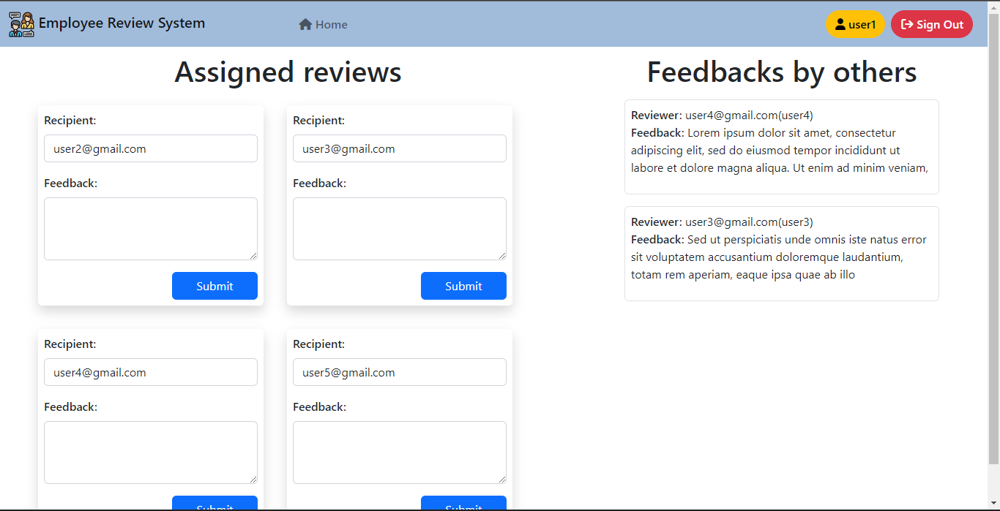

# Employee review system

This Employee review web application is created for employees to submit feedback toward each other's performance. User's could have either "employee" or "admin" role. There are two dashboard pages based on the role of the employee those dashboard pages will be rendered, User with role of admin can assign employees to participate in review of other employees. Employees can only submit feedback required by assigned reviews. \
It is built using NodeJs, ExpressJs, MongoDB, EJS and JavaScript.

### 🔗 Hosted link: [Employee review system](https://employee-review-system-ul7m.onrender.com)


## ⚙️ Functionality

### Admin's functions

- Add employee
- Delete employee
- Update employee details
- Assign review to employee
- Update review of employee

### Employee's functions

- Submit reviews assigned to it
- View reviews given by others

## 🧑‍💻 Getting started

- Fork the project
- Clone the forked repository in your local system
- Create .env file in the root directory and add the following:-
  - PORT="Your port number"
  - MONGODB_URL="Your MongoDB URL"
  - SESSION_SECRET_KEY="Your secret session key"
- Install all required packages

```bash
npm install
```

- Run project

```bash
npm start
```

The project is running on the port number provided by you.

## 🛠️ Tools Used

- NodeJS
- MongoDB
- ExpressJS
- EJS
- Bootstrap


## 🖼️ Screenshots




